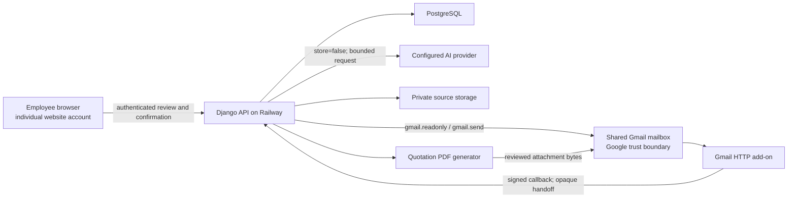
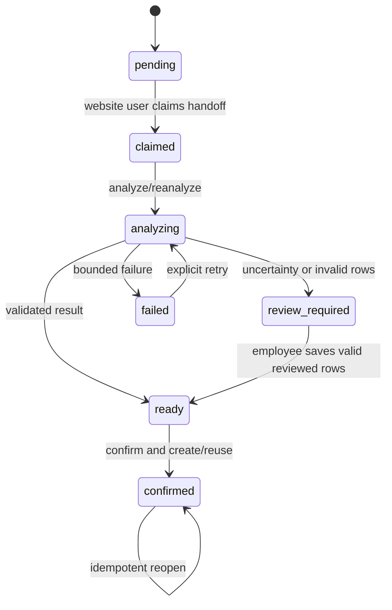
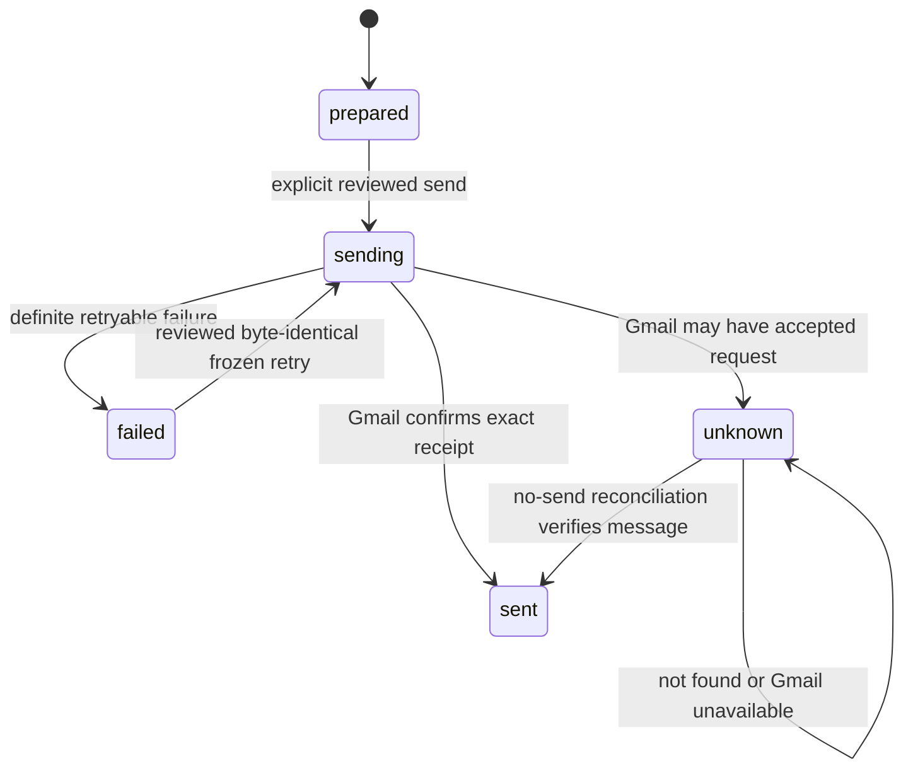

# Gmail-to-Quotation Architecture Reference

| Field | Value |
|---|---|
| Document version | 1.4.0 |
| Status | Current-state reference; branch-only hardening is identified explicitly |
| Owner | Al Ameen quotation-system maintainers |
| Last verified | 2026-08-01 |
| Reviewed code | `d88b767` baseline plus the Task 2.1, Task 2.2, and Task 2.3 checkpoints on `codex/technical-hardening` |
| Production snapshot | Railway deployment `c234c4bc-ba7e-4ed0-ab88-b5a1dcc2a6b8`, commit `70d3da7162b63864e479e9a1998aa138046c2433` |
| Scope | Gmail/manual inquiry intake, review, quotation creation, and reviewed Gmail delivery |

This document distinguishes what the repository implements from what was
measured or observed in one deployment. It is not a production-compliance
attestation. See [DEPLOYMENT.md](DEPLOYMENT.md), [SECURITY.md](SECURITY.md),
[OPERATIONS.md](OPERATIONS.md), and
[TECHNICAL_HARDENING_PROGRESS.md](TECHNICAL_HARDENING_PROGRESS.md) for the
corresponding runbooks and branch checkpoints.

## 1. Claim labels

| Label | Meaning |
|---|---|
| **Implemented** | Verified in the reviewed source commit and automated tests |
| **Measured** | Directly recorded for a named execution; not a general benchmark |
| **Derived** | Calculated from recorded values |
| **Deployment snapshot** | Read-only observation of external configuration at the date above |
| **External** | Time-sensitive provider behavior or documentation |
| **Proposed** | Not implemented |
| **Unknown** | Cannot be established from the repository or read-only snapshot |

## 2. System context and trust boundaries



**Implemented.** Add-on events, browser input, email content, attachments, and
AI output are all untrusted inputs. The backend re-fetches canonical Gmail
data and enforces authorization, evidence, and delivery rules server-side.
Employees share one Gmail identity, so individual attribution comes from the
authenticated website account that claims and confirms an import.

## 3. Supported employee workflows

| Area | Gmail add-on route | Manual upload/paste route |
|---|---|---|
| Start | Open a message and use the Gmail sidebar | Paste text or upload/drop a supported file |
| Selection | Current message, checked messages, or AI-assisted thread | One employee-selected source |
| Main extraction | One semantic thread/document request | Deterministic parsing, then optional AI cleanup |
| Revision reasoning | Message classification and cross-message revision semantics | Normally one source; no automatic thread reconstruction |
| Company suggestion | Verified sender/contact/domain plus signature/AI evidence | Employee selection, with existing suggestions |
| Product suggestion | Existing aliases, normalized names, and history | Same matcher |
| Selling price | Always blank after extraction | Always blank after extraction |
| Creation | Employee review, save rows, confirm | Employee review and explicit creation |
| Delivery | Reviewed reply in verified source thread | Reviewed new email, or explicitly linked exact Gmail message |

Both routes remain supported. Neither route creates products, aliases,
quotations, or customer emails solely because AI returned a result.

## 4. Gmail add-on and import lifecycle

### 4.1 Add-on runtime

**Implemented.** `gmail_addon/deployment.template.json` defines a Google
Workspace HTTP add-on. The contextual callback receives the current Gmail
message/thread context, verifies the Google-signed request, retrieves bounded
thread metadata, and renders message checkboxes. The action endpoint creates
an idempotent import and returns a short-lived opaque handoff URL. Long-running
analysis happens on the website, not inside Google's callback deadline.

The sidebar offers:

- **Let AI choose**: the analyzer classifies the available thread messages.
- **Import selected**: only employee-checked messages are authoritative.
- **Current only**: only the anchor message is analyzed.

Primary files:

- `gmail_addon/deployment.template.json`
- `backend/quotations/gmail_addon.py`
- `backend/quotations/gmail_inquiry_import.py`
- `frontend/src/components/quotations/GmailInquiryReview.js`

### 4.2 Authorization layers

There are two separate Google authorization layers.

1. **Add-on callback authorization.** The backend checks the Google system ID
   token, allowed audience, deployment service account, end-user token, host
   application, manifest permissions, and configured mailbox identity.
2. **Website mailbox OAuth.** The shared mailbox connection requests
   `gmail.readonly` for canonical evidence and `gmail.send` for explicit,
   reviewed quotation delivery. It is separate from the add-on's current-
   message scopes.

Tokens are encrypted with Fernet using a key derived from `DJANGO_SECRET_KEY`.
Rotating that Django key invalidates existing stored Gmail credentials and
therefore requires a planned mailbox reconnect. OAuth publication,
verification/security-assessment status, and organizational credential
ownership are **unknown** from source control; operators must record them.

### 4.3 State machine



**Implemented.** `GmailInquiryImport` stores mailbox/thread identifiers,
selection mode and fingerprints, message/attachment manifests, structured
analysis and evidence, candidates, errors, ownership, timing state, and the
resulting Inquiry/Quotation. Raw handoff tokens are returned once; only their
digests are stored. Row locks, attempt/source fingerprints, stale-response
checks, an analysis lease, unique constraints, and idempotent confirmation
protect concurrent actions. A confirmed thread reopens its quotation rather
than silently creating a revision.

## 5. Gmail source preparation and AI contract

### 5.1 Current source policy

**Implemented.** The backend re-fetches source data through the configured
shared mailbox. Current bounded inputs include each selected/thread message's
newest body, including Al Ameen replies when they are needed as conversation
context, useful HTML tables, and supported inbound PDF, XLS, and XLSX
attachments. Outbound bodies cannot establish customer-request rows, and Al
Ameen outbound quotation attachments are excluded as customer demand. The
pipeline also excludes signature logos/icons, normal image attachments,
unsupported files, and native XLSB input. Screenshots remain supported by the
manual image route.

Key defaults and enforced ceilings are intentionally separate:

| Input boundary | Default/configured limit | Enforced ceiling |
|---|---:|---:|
| Selected messages | 25 maximum | 25 |
| Thread messages | 50 | 100 |
| Attachment metadata | 100 per message | 100 per message |
| Parsed attachments | 30 maximum | 30 |
| Email body material | 120,000 characters maximum | 120,000 |
| Native files | 12 | 30 |
| Combined native bytes | 20 MiB | 49 MiB |
| Native PDF pages/document | 25 | no separate hard ceiling beyond configuration |
| Spreadsheet rows/sheet | 1,000 | 1,000 |

The Gmail request includes message boundaries, chronology, sender direction,
headers, each selected message's newest non-quoted body within configured
bounds, supported original document bytes, and server-created opaque source
keys. The application sends those bodies/files to the provider with
`store=false` and does not persist complete Gmail bodies or original document
bytes locally; provider/project retention and residency remain external,
operator-verified settings. The application retains identifiers, headers or
bounded snippets, hashes, manifests, structured results, and bounded evidence
excerpts rather than a second complete mailbox copy.

Requests use the OpenAI Responses API, strict structured output, and
`store=false`. Email/document content is explicitly treated as data, including
prompt-injection-looking text. Original Gmail PDF/Excel submission requires
both `QUOTATION_MAILBOX_AI_VISION_ENABLED` and the staff-facing quotation
setting `ai_pdf_vision_enabled`. This dual gate is not a claim that only page
images are sent.

### 5.2 Versioned contract

**Implemented in reviewed branch.** Current code constants are:

| Contract | Version |
|---|---|
| Gmail pipeline | `gmail_inquiry_v2` |
| Gmail schema | `gmail_inquiry_native_v2` |
| Gmail identity matcher | `gmail_identity_v3` |
| Manual AI cleanup | `manual_ai_cleanup_v1` |
| Mailbox PO vision | `mailbox_po_vision_v1` |
| AI parse observability | `ai_parse_observability_v1` |
| Outbound email snapshot | `quotation_email_outbound_v1` |

Every AI log also records content-free SHA-256 identities for the effective
prompt, schema, and pipeline contract. These hashes, provider, configured
model value, and request usage are the current reproducibility keys; the human-
readable model alias alone is insufficient. Repository defaults are
`gpt-4.1-mini`; the inspected Railway environment used the moving `gpt-5.4`
alias. Current provider code does not retain the model value returned in the
OpenAI response, so an exact provider snapshot is unavailable unless deployment
configuration pins it or future approved instrumentation captures it. No model,
prompt, or schema is changed by this documentation task.

The strict result requires a decision for every supplied message, effective
rows after revisions, exact requested wording, quantities/units, revision
operations, uncertainty, customer-price evidence, and valid row citations.
Application validation still rejects fabricated sources, invalid quantities,
missing citations, contradictory revisions, and customer rows supported only
by outbound supplier documents. Customer prices remain evidence only and all
selling prices are blanked.

### 5.3 Deterministic matching after extraction

AI may transcribe company/contact evidence, but deterministic ranking decides
whether it maps uniquely to stored records. Exact contact email, company email,
private domain, signature wording, branch specificity, and saved records are
considered conservatively. Ambiguous sibling branches remain unselected.

Products are suggestions from exact aliases, normalized names, company history,
and previous relationships. The employee confirms matches. The requested
snapshot name remains customer wording, and no new Product or alias is created
by Gmail intake.

## 6. Manual intake

**Implemented.** Manual intake accepts pasted text/HTML and uploaded or dropped
Excel, PDF, PNG, JPEG, and WebP sources. The server identifies the type. Local
parsers first produce review rows and provenance. Optional AI cleanup receives
compact parsed rows for clean text/Excel, or a bounded vision representation
where required. It does not normally classify a conversation or infer
cross-message revisions.

`AIParseCache` avoids a provider call for identical semantic work. In reviewed
branch commit `a6548aa`, a cache hit is rebound to the current upload's source
metadata and the reusable cache payload no longer duplicates full source text,
private file paths, or raw provider usage. Row evidence remains because it is
required for review.

Primary endpoints:

- `POST /quotations/inquiries/parse_text/`
- `POST /quotations/inquiries/parse_file/`
- `POST /quotations/inquiries/ai_clean_parse/`
- `POST /quotations/inquiries/create_imported/`
- `POST /quotations/inquiries/{id}/create_quote/`

The manual route can be faster for a clean workbook because the employee has
already selected one source and local code reduces it to compact rows. The
Gmail route performs broader selection, identity, revision, and evidence work.
This is an architectural explanation, not a universal performance result.

## 7. Review and quotation creation invariants

**Implemented.** Before creation, an employee must confirm the company,
optionally the purchaser, included rows, quantity/unit, evidence, uncertainty,
and saved review state. `Confirm & Open Quotation` atomically creates or reuses
the Inquiry and draft Quotation. These invariants apply to both routes:

- selling prices are blank after extraction;
- company and product matches are suggestions only;
- each usable row retains source evidence;
- uncertain/conflicting sources remain visible;
- AI cannot create products or aliases;
- repeated confirmation cannot silently duplicate a Gmail thread quotation.

## 8. Preview-before-send delivery

### 8.1 Preview and verified recipients

**Implemented.** Finalize opens an email preview with delivery mode, trusted
source, To/CC, subject, editable body, PDF filename, warnings, and Gmail
authorization. No send occurs until the explicit action. A draft can be
finalized without sending.

For Gmail-origin quotations, the server re-fetches the relevant inbound
message, derives exactly one customer recipient from `Reply-To` or `From`,
rejects ambiguous/self recipients, preserves the source subject, and supplies
the Gmail thread ID plus RFC `In-Reply-To` and `References`. Verified To and
subject are server-enforced.

Manual quotations default to a new email with explicit recipient confirmation.
An employee may instead search an exact expected sender and select one exact
Gmail message. The server issues a short-lived quotation/user-bound selection
token and revalidates the message again before sending; AI/fuzzy matching never
selects a reply thread.

Primary endpoints:

- `GET /quotations/quotes/{id}/email_preview/`
- `GET /quotations/quotes/{id}/email_thread_candidates/`
- `POST /quotations/quotes/{id}/finalize_and_send/`
- `POST /quotations/quotes/{id}/send_email/`
- `POST /quotations/quotes/{id}/reconcile_email/`

### 8.2 Delivery state and reconciliation



**Implemented in reviewed branch.** `QuotationEmailDelivery` remains the
backward-compatible one-to-one aggregate state per quotation revision. Task
2.2 adds one write-once `QuotationEmailOutboundSnapshot`, one permanent
`QuotationEmailDeliveryAttempt` child row for every actual Gmail send call,
and append-only `QuotationEmailDeliveryAttemptEvent` facts for its result.
The snapshot stores the exact RFC-MIME bytes, including the PDF, plus the
mailbox, recipient/CC, subject, body, Gmail API thread argument, RFC reply
headers, attachment digest/size, and a versioned complete-snapshot digest.
Known-safe retries verify and resend the persisted bytes; they do not rerender
the PDF, refetch a different source message, or rebuild MIME boundaries.

Snapshot and attempt rows reject model, bulk, and administration mutation.
Provider results (`sent`, `failed`, or `unknown`) and strict reconciliation
proof are separate append-only event rows, so later Gmail proof never erases
the original timeout, HTTP classification, or uncertainty. Double clicks still
serialize. A potentially accepted but unconfirmed request remains `unknown`;
blind retry remains blocked. Pre-Task-2.2 records are not falsely backfilled:
legacy failed rows create their first honest snapshot only on a later explicitly
reviewed retry, while legacy sent/unknown rows retain aggregate reconciliation
compatibility.

Reconciliation never sends. It searches by the stable outbound RFC Message-ID
and exact connected mailbox and accepts a candidate only after verifying:

- Gmail `SENT` label;
- exact shared-mailbox `From` identity;
- exact RFC Message-ID;
- non-empty Gmail thread ID; and
- the expected source thread for a reply.

A successful empty search is distinct from a Gmail/API failure. Both remain
locked for safe later inspection; neither permits an automatic resend. The
API reports Gmail/search unavailability separately (`503`), rejects malformed
reconciliation provenance (`400`), and rejects multiple fully verified matches
as a conflict (`409`). The aggregate delivery tables were introduced by
migration `0034`; the additive snapshot/attempt/event tables are introduced by
`backend/quotations/migrations/0035_quotationemailoutboundsnapshot_and_more.py`.

The server rebuilds and revalidates delivery inputs at send time. Task 2.1 also
adds two keyed stale-preview guards. The editor fingerprint covers the customer-facing
quotation revision shown to the employee. The email fingerprint additionally
covers the projected finalized state, attachment metadata, staff actor, and
verified Gmail source. The shipped editor retrieves the current quotation
before opening a preview; that detail response materializes its rows and token
under one locked database snapshot and requires another explicit action if it
changed. The browser compares both the token and displayed payload, so even an
older unlocked error response cannot pair unseen rows with a current token;
stale-preview refresh passes through the same gate.
A new or retry send requires the email fingerprint and compares it under the
authoritative quotation, delivery, line, customer/contact, PDF-settings,
creator, catalogue/image, and Gmail-connection locks.

After finalization, the exact PDF and raw MIME bytes for the first attempt are
built while those database dependencies remain locked, then the immutable
snapshot, an immutable provider-attempt request row, and aggregate `sending`
state commit
atomically. Only the Gmail network request happens afterward, and its payload
is re-encoded from the persisted snapshot. Missing or changed reviews are blocked
and must be explicitly refreshed and reviewed; refresh never sends. The guard
does not content-hash remote bytes that could be overwritten out of band at an
unchanged storage key before the first snapshot is created. Once created, the
persisted raw MIME and complete digest prevent a retry from inheriting such a
later change. A process death in the narrow commit-before-HTTP gap may leave an
attempt without a result event even if Gmail was never reached; safety deliberately wins
over availability, so stale `sending` still enters no-send reconciliation and
never becomes blindly retryable.

## 9. Observability and the measured example

**Implemented in reviewed branch.** Gmail, manual, and mailbox-PO AI routes
write comparable content-free timing, token, cache, validation, and contract
identity fields into the existing `AIParseLog.usage` JSON. Gmail also records
fetch, preparation, matching, persistence, and total route stages. Logs do not
copy prompts, full source bodies, filenames, Gmail IDs, or tokens into the new
observability envelope.

The following is one historical Cranleigh execution, not a production
benchmark. Its original record predates the complete branch observability
contract, so some reproducibility fields are unavailable.

| Claim | Value | Classification |
|---|---:|---|
| Analysis duration | 90.530 s | Measured for one execution |
| AI log arrival after analysis start | 89.778 s | Measured for one execution |
| Post-AI work | at most 0.752 s | Derived upper bound |
| Messages / attachment metadata | 3 / 30 | Measured |
| Native AI documents | one 16,309-byte XLSX | Measured |
| Output rows | 34 | Measured |
| Input / output tokens | 9,432 / 4,872 | Measured |
| Provider work dominated this execution | yes | Inferred from the measurements |
| Provider work is the general production bottleneck | not established | Unknown pending representative evaluation |

A reproducible future result must include UTC time, environment/commit,
sanitized case key, route/mode, selected message and source counts, provider,
configured model value (and exact snapshot only when separately available),
pipeline/schema versions, prompt/schema/contract hashes, cache state, measured
stages, validation result, and token usage.

## 10. Cost interpretation

**External, verified 2026-08-01.** The inspected deployment used OpenAI API
billing; a ChatGPT subscription does not pay those API charges. The published
GPT-5.4 standard rates were USD 2.50/M uncached input tokens, USD 0.25/M cached
input tokens, and USD 15/M output tokens. Recheck the
[official GPT-5.4 model page](https://developers.openai.com/api/docs/models/gpt-5.4)
before making a current-cost decision.

```text
(uncached input / 1,000,000 × input rate)
+ (cached input / 1,000,000 × cached-input rate)
+ (output / 1,000,000 × output rate)
```

The three historical calls below reported no cached-input amount, so their
approximate calculations remain:

| Historical example | Input | Output | Approximate API cost |
|---|---:|---:|---:|
| Cranleigh Gmail-native analysis | 9,432 | 4,872 | USD 0.0967 |
| Small manual Excel cleanup | 1,413 | 906 | USD 0.0171 |
| Large manual Excel cleanup | 7,717 | 7,162 | USD 0.1267 |

These are illustrations, not estimates for all inquiries. Deterministic parse
has no inference charge; a manual cache hit makes no provider call; response
rows/citations can dominate cost; and a large manual job may cost more than a
small Gmail thread.

## 11. Data classification, retention, and durability

| Data | Current location | Protection/constraint | Retention state |
|---|---|---|---|
| Gmail OAuth tokens | PostgreSQL | Fernet encryption; access-controlled | No scheduled lifecycle; reconnect on key rotation |
| Gmail messages/documents | Gmail; transient provider request | Canonical re-fetch; bounded request; `store=false` | Gmail policy/provider terms apply |
| Structured import/evidence | PostgreSQL | Staff-only APIs; bounded excerpts | No application purge policy |
| AI cache/log | PostgreSQL | source hashes, semantic rows/evidence, content-free metrics | No scheduled purge policy |
| Manual source files | dedicated `quotation_evidence` storage alias | versioned opaque keys, SHA-256 integrity, fail-closed reads, staff-only retrieval | Local filesystem by default; no automatic purge |
| Exact outbound MIME/PDF snapshot | PostgreSQL | 35 MiB cap, complete digest, omitted from APIs/admin form, byte-identical retry | No scheduled purge policy; backup/capacity policy required |
| Audit/delivery ledgers | PostgreSQL | staff-only/read-oriented application access | No scheduled purge policy |

**Task 2.3 implementation.** All application-managed quotation-source writes
use the dedicated `quotation_evidence` Django storage alias rather than default
media/Cloudinary. New keys are versioned, content-addressed, omit the customer
filename, and are verified against SHA-256 on reads. Existing unversioned refs
remain compatible: the confined legacy local copy wins when present, otherwise
an operator-copied object can be read from the active backend under the same
key. A versioned active-backend miss can use the previous confined local copy
only after validating the full digest embedded in its key; backend failure is
distinct from definite not-found and never permits fallback. Reads/writes are
bounded and a successful write is immediately read back and checked. No model,
public API, frontend, OAuth, AI, or selling-price behavior changed.

**Deployment snapshot.** Railway had no volume and
`QUOTATION_PRIVATE_STORAGE_ROOT` was not explicitly configured. The repository
contains no approved private object-store package, provider, bucket, or
credentials, so the configured default remains an ephemeral local filesystem
even though the application abstraction is ready. Live provider selection,
legacy-object copy, access/residency policy, backup, and restore verification
remain operator-owned configuration work.

The Gmail inquiry and mailbox-PO pipelines continue to keep Gmail as the
canonical binary store. Contract-intelligence Gmail discovery is a distinct
workflow that currently retains supported parsed attachments through this
private storage alias; it must not be described as transient-only. Abandoned
manual previews and some short-lived price-reference parsing may also leave
unreferenced objects. No purge was added because retention and legal-hold rules
are not approved.

Formal retention periods, deletion/legal-hold rules, backup RPO/RTO, restore
drills, OAuth verification status, and provider contractual settings are
**unknown/operator-owned gaps**. See [OPERATIONS.md](OPERATIONS.md).

## 12. Evaluation and proposed improvements

### 12.1 Implemented evaluation seed

**Implemented in reviewed branch at `d88b767`.** A 30-case fully synthetic
semantic corpus covers both routes and ten case families. It validates exact
rows, quantities/units, revisions, message selection, citations, identity,
ambiguity, and blank selling prices offline:

```text
cd backend
python manage.py evaluate_quotation_intake
```

The corpus is not representative production evidence and does not test binary
render/OCR fidelity. A real irreversibly de-identified, independently
adjudicated benchmark remains **proposed** and carries privacy,
re-identification, and reviewer-agreement risks.

### 12.2 Ranked experiments

| Experiment | Status | Prerequisite | Primary metric / stop rule |
|---|---|---|---|
| Collect paired manual/Gmail baselines with current instrumentation | Proposed; instrumentation implemented | representative approved cases | no loss in strict row/evidence/identity score |
| Compact output schema | Proposed | golden baseline | reject on any evidence/revision regression |
| Clean-Excel pre-extraction before Gmail semantic call | Proposed | selection-boundary tests | retain all effective rows and citations |
| Content/version-bound Gmail semantic reuse | Proposed (Task 2.6) | immutable source identity | never reuse across content/provider/model/prompt/schema/pipeline changes |
| Reduce Gmail retrieval round trips | Proposed (Task 2.6) | canonical-source tests | preserve current/selected/AI mode boundaries |
| Benchmark other models | Optional/Phase 3; not authorized | approved model change and golden set | quality threshold before latency/cost |
| Background worker | Optional/Phase 3; not authorized | infrastructure decision | no review/state regression |

Existing API paths and request schemas, OAuth scopes, AI model/prompt/schema,
and production infrastructure are unchanged. Task 2.2 adds only the preview/
delivery flag `outbound_snapshot_frozen` plus safe snapshot mismatch,
integrity, and size errors.

## 13. Test and deployment provenance

The delivery implementation at deployed baseline `70d3da7` had mocked
Gmail/OpenAI-focused backend and frontend test coverage plus a successful
production-mode frontend build. Those historical totals are not a live-service
proof. Branch hardening commands/results are recorded per commit in
[TECHNICAL_HARDENING_PROGRESS.md](TECHNICAL_HARDENING_PROGRESS.md).

The canonical PostgreSQL concurrency reproduction is the
`postgres-concurrency` job in `.github/workflows/ci.yml`: PostgreSQL 17.10,
`READ COMMITTED`, and bounded lock/statement timeouts. Running the same test
module against default SQLite intentionally skips PostgreSQL-only cases.

## 14. Source index

- `backend/quotations/gmail_addon.py`
- `backend/quotations/gmail_inquiry_import.py`
- `backend/quotations/ai_parsing.py`
- `backend/quotations/quotation_email_delivery.py`
- `backend/quotations/private_storage.py`
- `backend/quotations/models.py`
- `frontend/src/components/quotations/GmailInquiryReview.js`
- `frontend/src/components/quotations/QuotationEmailPreviewDialog.js`
- `gmail_addon/deployment.template.json`
- `backend/quotations/evaluation_corpus/quotation_intake_v1.json`
