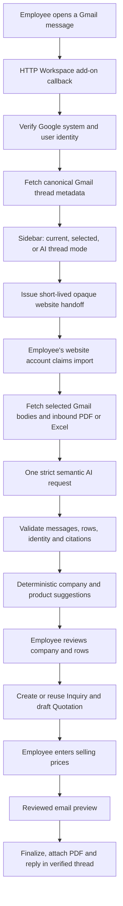
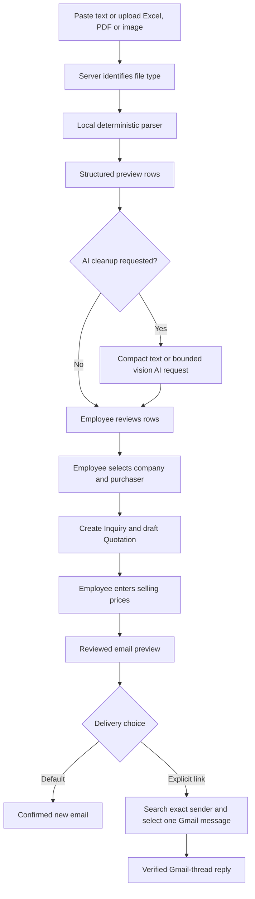

# Gmail-to-Quotation Architecture and Performance Review

Prepared for an external architecture review of the Al Ameen Pharmacy quotation system.

## 1. Executive summary

The application has two deliberately different inquiry-intake routes:

| Area | Gmail add-on route | Manual upload or paste route |
|---|---|---|
| Employee starting point | Open a customer email and use the Gmail sidebar add-on | Download, paste, drag or select a source file |
| Source context | One message, selected messages, or an entire thread | Usually one employee-selected file or pasted block |
| Document extraction | One semantic AI request receives selected email bodies and original supported documents | A local deterministic parser extracts rows first; AI cleanup is optional |
| Revision understanding | AI classifies the conversation and applies revisions/clarifications | Normally no cross-email revision context |
| Company discovery | Sender/contact email, domain, signature text and AI-read identity, followed by deterministic database ranking | The employee normally selects the company and purchaser |
| Evidence | Each included row requires message/document/page/sheet/cell provenance | Simpler file/page/sheet/row provenance |
| Product decisions | Existing deterministic aliases/history suggest products; staff confirms | Same product matcher and review process |
| Selling prices | Always left blank for staff | Always left blank for staff |
| Typical clean-Excel latency | Higher and more variable | Usually lower |
| AI cost | Usually higher because the task and response are larger | Zero for deterministic-only; usually lower for compact AI cleanup |
| Final customer email | Verified reply in the source Gmail thread | Confirmed new email, or an explicitly linked Gmail message chosen by staff |

The Gmail route currently optimizes total employee workflow and thread understanding, not raw model latency. Its main production bottleneck is the large structured AI response, not company matching or file transfer.

The new finalization workflow adds a reviewed email preview. Nothing is emailed merely because the employee opens the preview. Gmail-origin quotations reply in a verified thread. Manual quotations default to a clearly labelled new email and may be linked to an exact inbound Gmail message only through explicit staff selection.

## 2. End-to-end architecture

### 2.1 Gmail add-on route



### 2.2 Manual route



## 3. Method A: Gmail thread-to-quotation

### 3.1 Gmail add-on runtime

The add-on is a Google Workspace add-on implemented with Railway-hosted HTTP endpoints rather than Apps Script business logic. Its manifest is in `gmail_addon/deployment.template.json`; deployment and configuration instructions are in `gmail_addon/README.md`.

Google sends the currently open Gmail `messageId` and `threadId` to the contextual callback. The backend retrieves the thread and renders its messages as checkboxes in the sidebar. This is how the product offers multi-message selection even though Gmail's contextual event supplies only the current message/thread context.

The sidebar offers:

- **Let AI choose**: analyze the thread and determine which messages are inquiry, revision, clarification, follow-up or context.
- **Import selected**: use only the employee-checked messages as the authoritative selection.
- **Current only**: analyze only the open message.

The add-on callback does not wait for the model. It creates an import handoff and opens the website, where the longer analysis runs with visible progress and resumable polling.

Primary code:

- `gmail_addon/deployment.template.json`
- `backend/quotations/gmail_addon.py`
- `backend/quotations/gmail_inquiry_import.py`
- `frontend/src/components/quotations/GmailInquiryReview.js`

Google references:

- [HTTP Google Workspace add-ons](https://developers.google.com/workspace/add-ons/guides/alternate-runtimes)
- [Workspace add-on event objects](https://developers.google.com/workspace/add-ons/concepts/event-objects)
- [Selection inputs](https://developers.google.com/apps-script/reference/card-service/selection-input)

### 3.2 Authentication boundaries

There are two separate Google authorization layers.

#### Add-on callback authorization

The backend validates the Google-signed callback before reading mailbox data. Checks include:

- system ID token signature and issuer;
- exact allowed callback audience;
- configured deployment service-account identity;
- end-user Google ID token;
- host application and required add-on scopes;
- configured shared Gmail identity.

The callback data is treated as untrusted until those checks pass.

#### Shared website Gmail authorization

The application separately stores encrypted OAuth tokens for the one shared mailbox. This connection is used for mailbox-wide reading and, after the new one-time reconnection, sending.

Required website OAuth scopes:

- `https://www.googleapis.com/auth/gmail.readonly`
- `https://www.googleapis.com/auth/gmail.send`

The add-on manifest's current-message permissions remain separate. The add-on itself does not need mailbox-wide send permission simply because the website backend sends the finalized quotation.

When Gmail is reconnected from a quotation preview, the exact quotation return
path is carried inside the short-lived signed OAuth state. The backend accepts
only a relative `/admin` path, preventing an external/open redirect. Google
authorization therefore returns staff to the same quotation rather than to a
generic settings screen. Once a shared connection exists, only its credential
owner or a superuser is offered the replace/reconnect action. If no shared
connection exists yet, any authenticated quotation staff member can initiate
the first connection.

Google classifies `gmail.send` as a narrower sensitive sending scope and `gmail.readonly` as a restricted read scope. See [Gmail API scopes](https://developers.google.com/workspace/gmail/api/auth/scopes).

All employees share `pharmacydxb@gmail.com`, so Google cannot identify the individual employee. The employee's authenticated website account claims the handoff and supplies the audit identity.

### 3.3 Handoff, ownership and idempotency

`GmailInquiryImport` is the durable state machine. It stores:

- mailbox, thread and anchor identifiers;
- selected message IDs and selection mode;
- selection and content fingerprints;
- message and attachment manifests;
- analysis, evidence, warnings and timing stages;
- company/contact candidates;
- claim owner and analysis attempt state;
- resulting Inquiry and Quotation.

The browser receives only a random handoff token. The raw token is returned once; only its digest is stored. Tokens are short-lived and bounded per import.

Repeated clicks for an identical mailbox/thread/selection reuse the same logical import. A claimed import cannot be silently taken over by another employee. A confirmed thread reopens its existing quotation rather than creating a duplicate or automatic revision.

Important concurrency controls include:

- database row locks when claiming, analyzing, reviewing and confirming;
- an analysis attempt counter and source fingerprint;
- stale-response rejection if selection changes during a request;
- a ten-minute stale-analysis lease;
- a unique confirmed mailbox/thread constraint;
- idempotent confirmation and quotation reuse;
- confirmed-import immutability.

### 3.4 Gmail retrieval and attachment policy

The backend re-fetches canonical Gmail data through the shared mailbox. It does not trust message contents supplied by the browser.

Current bounded limits include:

| Limit | Current default or hard bound |
|---|---:|
| Selected messages | 25 |
| Thread messages | 50 |
| Attachment metadata per message | 100 |
| Attachments considered per import | 30 |
| Email body context | 120,000 characters |
| Native AI files | 12 |
| Combined native file input | 20 MiB |
| Native PDF pages per document | 25 |
| Spreadsheet rows per sheet | 1,000 |

The Gmail V2 semantic request includes:

- inbound newest email bodies;
- HTML only when it contains a useful table;
- inbound PDF;
- inbound XLSX;
- inbound XLS.

It intentionally excludes:

- Al Ameen's outbound quotation attachments as customer inquiry evidence;
- inline logos, icons and signature graphics;
- PNG/JPEG/WebP email attachments;
- unsupported documents;
- XLSB from the native-file AI route.

Screenshots remain supported by the manual image-upload route. This distinction avoids submitting dozens of signature images as inquiry evidence, but a future add-on enhancement could permit an employee to explicitly choose a genuine screenshot attachment.

Gmail remains the canonical store for full messages and documents. Complete bodies are transmitted transiently for analysis but are not copied wholesale into the database. The database retains hashes, IDs, manifests, structured rows and bounded evidence.

### 3.5 What the Gmail AI receives

One semantic model request receives:

- complete selected/newest email bodies;
- message boundaries, chronology and sender direction;
- subject, sender, recipients and timestamps;
- original supported inbound PDF/Excel bytes;
- server-created opaque evidence source keys;
- instructions that email/document content is untrusted data, not executable instructions.

The production model observed for the measured requests is `gpt-5.4`, configured through Railway rather than hard-coded in the Gmail feature.

The request uses a strict JSON schema through the application's OpenAI Responses provider. Structured Outputs enforce the response shape, while application code still performs semantic and provenance validation.

The schema requires:

- a classification and used/context/excluded decision for every supplied message;
- current effective rows after revisions and clarifications;
- exact customer wording, quantity and unit;
- added/changed/removed/unchanged/duplicate/uncertain operations;
- customer budget or price only as evidence;
- confidence and review status;
- at least one valid citation for each included row;
- page, sheet and cell location where available;
- a bounded raw evidence excerpt;
- customer company/contact identity read from sender/signature evidence;
- warnings and a thread summary.

The prompt explicitly handles examples such as:

- "Ignore the previous file; use the revised attachment";
- "Change gloves to 20; masks unchanged";
- a follow-up such as "Any update?" that points back to the actual inquiry.

No deterministic document parser runs after this Gmail AI extraction. This prevents a second parser from overwriting the semantic result. A proposed performance improvement is deterministic **pre-extraction** for clean spreadsheets before the one semantic AI call; it is not a second parser after AI.

### 3.6 Server validation after AI

The backend rejects or flags:

- unknown or excluded source keys;
- fabricated messages;
- missing row citations;
- invalid or non-positive quantities;
- blank included item names or units;
- contradictory revision output;
- rows that cite outbound supplier documents as customer demand.

Removed and duplicate rows are excluded. Uncertain rows require explicit staff review. Customer prices are retained only as evidence. Every quotation selling price is reset to blank.

### 3.7 Company and purchaser matching

AI transcribes identity evidence, but deterministic logic decides whether it uniquely maps to saved records. Ranking considers:

- exact inbound contact email;
- exact company email;
- unique private sender domain;
- saved company name related to the domain;
- exact company wording in a signature;
- AI-transcribed company/contact identity;
- conservative OCR/spelling variants;
- branch/property specificity.

Verified sender evidence outranks fuzzy similarity. Conflicting or ambiguous evidence is deliberately left unselected. A sole candidate is not promoted unless the backend explicitly recommends it. Staff must acknowledge and confirm the selected company.

The measured Cranleigh delay did not come from this matcher; it ran after AI and took a small fraction of a second together with product suggestions and persistence.

### 3.8 Product matching and review

After extraction, the existing matcher suggests Products using:

- exact aliases;
- normalized product names;
- company-specific quotation history;
- existing product/quote-item relationships.

Suggestions remain unresolved until an employee confirms them. The Gmail route does not automatically create Products or aliases. Snapshot wording remains the customer's inquiry wording; selling prices remain blank.

The employee review must confirm:

- company and optionally purchaser;
- included item name, quantity and unit;
- source evidence;
- uncertain rows;
- saved reviewed-row state.

`Confirm & Open Quotation` atomically creates or reuses the Gmail-sourced Inquiry and draft Quotation.

## 4. Method B: manual upload/paste with optional AI cleanup

### 4.1 Input

The employee may:

- paste text or an HTML table;
- drag/select XLSX, XLS, XLSB or PDF;
- drag/select PNG, JPEG or WebP.

The server identifies the file type. The employee does not select a parser.

Primary code:

- `frontend/src/components/quotations/InquiryManager.js`
- `backend/quotations/views.py` inquiry parsing actions
- `backend/quotations/import_parsers.py`
- `backend/quotations/ai_parsing.py`

### 4.2 Deterministic parsing first

The normal manual route first performs local parsing:

- **Excel**: locate headers, map item/quantity/unit/price columns, read rows and retain sheet/row provenance;
- **PDF**: extract selectable text/tables and apply alternate layout rules, with OCR/vision support where configured;
- **pasted HTML/text**: parse HTML tables first, then structured/plain-text rules;
- **images**: validate/normalize and use the bounded vision path.

Typical manual defaults include a 5 MiB upload, ten PDF pages, ten Excel sheets and 500 rows per sheet, subject to deployment settings.

### 4.3 Optional AI clean parse

For a clean Excel workbook, the optional AI step normally receives the compact rows produced by the local parser rather than original workbook bytes. Its output schema is smaller:

- item;
- quantity;
- unit;
- visible source price/total;
- confidence/status;
- short warnings/document notes.

It does not need to classify a thread, determine sender direction, apply cross-email revisions, infer the selected company or return message-level decisions.

Manual PDF/image cleanup may use a bounded vision representation rather than the compact text path.

The manual AI route has `AIParseCache`, keyed from immutable source/context plus provider/model/mode/prompt contract. An identical cache hit avoids another provider call.

### 4.4 Review and creation

The employee reviews the rows, selects the company and purchaser, then creates an imported Inquiry and draft Quotation. The same product review rules apply. No selling price is taken from the customer source.

Relevant endpoints:

- `POST /quotations/inquiries/parse_text/`
- `POST /quotations/inquiries/parse_file/`
- `POST /quotations/inquiries/ai_clean_parse/`
- `POST /quotations/inquiries/create_imported/`
- `POST /quotations/inquiries/{id}/create_quote/`

## 5. Why manual clean Excel can be faster

The two routes are not asking AI to do the same job.

Manual clean Excel is usually faster because:

1. The employee has already selected the only relevant file.
2. Python cheaply reduces the workbook to structured candidate rows.
3. AI receives a compact text representation rather than a native workbook plus thread.
4. The manual response schema is smaller.
5. It does not classify every message.
6. It does not reconstruct revisions or sender direction.
7. It does not identify the company from a signature/domain.
8. Its evidence contract is lighter.
9. Identical inputs can hit `AIParseCache`.

The Gmail route removes more employee work before and after the model call, but makes the model perform more reasoning and generate more structured output.

## 6. Observed production bottleneck

For the measured Cranleigh import:

| Measurement | Observed value |
|---|---:|
| Import creation to analysis start | 7.650 s |
| Analysis duration | 90.530 s |
| AI log arrival after analysis start | 89.778 s |
| Post-AI assembly, company/product matching and persistence | <= 0.752 s |
| Thread messages | 3 |
| Attachment metadata records | 30 |
| Actual native AI documents | 1 XLSX |
| XLSX size | 16,309 bytes |
| Ignored signature images | 9 |
| Excluded outbound attachments | 20 |
| Extracted rows | 34 |
| AI calls | 1 |
| Recorded retries/errors | 0 |
| Input tokens | 9,432 |
| Output tokens | 4,872 |
| Total tokens | 14,304 |

The AI provider phase dominated the request. The workbook's byte transfer and the company matcher were not meaningful causes of the 90-second wait.

The deployed timing instrumentation now records safe numeric durations for:

- Gmail/thread fetch;
- source/attachment preparation;
- AI provider call;
- AI response validation;
- total AI analysis;
- post-AI company/product matching;
- result persistence;
- total request.

No email contents or tokens are stored in the timing object.

## 7. Cost comparison

The website uses OpenAI API billing. A ChatGPT Pro subscription is separate and does not pay for these API calls.

At the currently published GPT-5.4 standard API prices of USD 2.50 per million input tokens and USD 15.00 per million output tokens, the formula is:

```text
(input tokens / 1,000,000 x USD 2.50)
+ (output tokens / 1,000,000 x USD 15.00)
```

Official model reference: [GPT-5.4 API model and pricing](https://developers.openai.com/api/docs/models/gpt-5.4).

### Observed examples

| Example | Input | Output | Approx. API cost |
|---|---:|---:|---:|
| Cranleigh Gmail-native thread analysis | 9,432 | 4,872 | USD 0.0967 |
| Recent small manual Excel AI cleanup | 1,413 | 906 | USD 0.0171 |
| Recent large manual Excel AI cleanup | 7,717 | 7,162 | USD 0.1267 |

These examples show that manual parsing is not automatically cheaper. Clean compact spreadsheets usually are; a very large manual row set can cost as much or more.

Other cost facts:

- deterministic parsing has no OpenAI inference charge;
- Gmail API reads/sends do not consume OpenAI tokens;
- file byte size alone does not predict model cost;
- output rows, citations and explanations can dominate cost;
- manual cache hits make no new provider call;
- completed Gmail imports are reused, but Gmail semantic analysis does not yet share the general cross-import `AIParseCache`.

Prices can change; recompute this section against the provider's current official pricing when reviewing later.

## 8. Preview-before-send quotation delivery

### 8.1 Shared behavior

Clicking **Finalize** opens a reviewed email dialog. It displays:

- delivery type;
- trusted source details, when available;
- To and CC;
- subject;
- editable standardized body;
- final PDF filename;
- warnings and Gmail authorization status.

For a draft quotation, the actions are **Finalize & Send Quotation**,
**Finalize Only**, and Cancel. **Finalize Only** finalizes the quotation,
downloads its PDF, and sends no email. For an already-finalized quotation, the
actions are **Send Quotation** and Cancel. If Gmail send permission is missing,
the send action is disabled while **Finalize Only** remains available for a
draft.

The dialog previews the delivery mode, recipient, CC, subject, body and
attachment filename. It does not render the PDF pages inline; staff who need to
inspect the final PDF contents first can use **Finalize Only**, review the
download, then reopen **Email Quotation**.

No email is sent until the explicit send action.

### 8.2 Gmail-origin quotation

For a quotation linked to `GmailInquiryImport`, the backend:

1. chooses the latest relevant inbound customer message;
2. re-fetches its immutable Gmail/RFC headers;
3. derives To from one valid `Reply-To`, otherwise one valid `From`;
4. rejects ambiguous/self recipients;
5. locks the exact original subject;
6. attaches the finalized quotation PDF;
7. submits the Gmail `threadId` plus RFC `In-Reply-To` and `References`.

The verified To and subject are read-only in the dialog. Body and optional CC remain editable.

Google requires the thread ID, matching subject and compliant reply headers for a message to remain in a conversation. See [Gmail thread requirements](https://developers.google.com/workspace/gmail/api/guides/threads).

### 8.3 Manual quotation default: new email

A downloaded file contains no trustworthy Gmail message or thread identity. The safe default is therefore **New email - not a reply**.

The recipient is suggested from:

1. selected CompanyContact email;
2. otherwise selected Company email;
3. otherwise an employee-entered address.

The employee must explicitly confirm the recipient. The email starts a new Gmail conversation.

### 8.4 Optional manual link to an exact Gmail message

If the employee wants a real reply for a manually parsed quotation:

1. enter one valid expected customer email;
2. click **Find original Gmail thread**;
3. the backend runs an exact `from:` search over recent inbound mail (currently bounded to the last two years) in the shared mailbox;
4. every result is re-fetched and exact-sender validated;
5. the UI displays sender, subject, date and snippet;
6. the employee selects one exact message;
7. the server issues a quotation-bound, confidential, short-lived selection token;
8. preview is rebuilt as a verified Gmail reply;
9. the server re-fetches and revalidates the message again before sending.

No AI or fuzzy matcher chooses the thread. Omitting the selected token keeps the delivery as a new email.
The manual selection is deliberately temporary browser state: closing or
reloading the dialog before sending requires another search and selection, and
a new search invalidates previously issued selection tokens for that quotation
and employee.

Relevant endpoints:

- `GET /quotations/quotes/{id}/email_preview/`
- `GET /quotations/quotes/{id}/email_thread_candidates/?recipient=...`
- `POST /quotations/quotes/{id}/finalize_and_send/`
- `POST /quotations/quotes/{id}/send_email/`
- `POST /quotations/quotes/{id}/reconcile_email/`

### 8.5 Standard body

The server prepares an editable body similar to:

```text
Dear {Purchaser first name or Sir or Madam},

Greetings.

Thank you for your inquiry. Please find attached our quotation
{Quotation Number} for your review.

Should you require any clarification or revision, please feel free to contact us.

Best regards,
Al Ameen Pharmacy LLC
```

### 8.6 Gmail API message format

The server creates an RFC-compatible MIME message, attaches the PDF, base64url-encodes the message into Gmail's `raw` field, then uses `users.messages.send`. See [Gmail sending guide](https://developers.google.com/workspace/gmail/api/guides/sending).

## 9. Delivery data model and reliability

`QuotationEmailDelivery` is a one-to-one delivery ledger for each Quotation/revision. It records:

- actor and quotation;
- Gmail connection/import;
- reply or new-email mode;
- prepared/sending/sent/failed/unknown status;
- To, CC, subject and body;
- trusted source evidence;
- source Gmail/RFC thread headers;
- stable outbound RFC Message-ID;
- Gmail response message/thread IDs;
- PDF filename, SHA-256 and byte size;
- attempt count, safe error and timestamps.

This ledger and the opaque manual-thread selections are introduced by Django
migration `quotations/0034_alter_quotationauditlog_action_and_more.py`. The
migration is additive: it creates the two delivery tables and extends audit-log
action choices; it does not rewrite quotation or inquiry rows.

### 9.1 Transaction boundary

Finalization and Gmail delivery are deliberately not one database/network transaction:

1. validate recipient and known Gmail authorization preconditions;
2. finalize the quotation in the database;
3. commit a `sending` delivery record;
4. generate/hash the exact PDF;
5. call Gmail outside the database transaction;
6. mark both delivery and quotation `sent` only after Gmail confirms success.

If PDF generation or Gmail definitely fails after finalization, the quotation
remains finalized. The UI permits a reviewed retry only when the backend marks
the failure retryable and the regenerated PDF still matches the stored hash.
An attachment snapshot mismatch is non-retryable and requires a new reviewed
quotation revision.

### 9.2 Idempotency and ambiguous sends

The one-to-one quotation relation, row locks and `sending`/`unknown`/`sent`
status checks prevent duplicate sends from double clicks. The stable outbound
RFC Message-ID provides the identity used to reconcile an ambiguous result in
Gmail; it is not the lock itself.

If the response is ambiguous after Gmail may have received the request:

- status becomes `unknown`;
- blind retry is blocked;
- the backend searches Gmail by the stable RFC Message-ID;
- a found matching message is reconciled as sent;
- otherwise staff must inspect the shared Sent mailbox before further action.

The preview exposes **Check Gmail status** for `unknown` and recoverable
`sending` records. That endpoint only searches by the stable RFC Message-ID; it
never calls Gmail's send endpoint. A found message is reconciled as sent. A
fresh in-progress or still-unconfirmed delivery remains locked.

HTTP 408/425/429, server errors, network timeouts and incomplete/mismatched Gmail receipts are handled as potentially ambiguous after the request begins.

On retry after a definite failure, the regenerated PDF hash must match the stored attachment hash. A changed attachment requires a reviewed revision rather than silently sending different bytes under the same delivery record.

## 10. Security and privacy properties

- Google-signed add-on requests are verified before mailbox access.
- The shared mailbox is allow-listed and independently OAuth-authorized.
- OAuth tokens are encrypted at rest.
- Handoffs and manual thread selections use short-lived opaque bearer tokens.
- The browser necessarily carries those opaque handoff/selection tokens, but
  raw Gmail message/thread IDs and Gmail OAuth credentials are not exposed as
  actionable browser parameters.
- Email/document text is treated as untrusted AI input.
- Full Gmail bodies/files are not duplicated into the application database.
- AI cannot create products, aliases, prices, quotations or emails without staff actions.
- Selling prices remain blank after intake.
- Verified Gmail reply To/subject are server-enforced, not merely read-only HTML fields.
- Manual recipients require explicit confirmation.
- Staff identity, recipients, PDF hash, Gmail IDs and outcomes are auditable.
- Unknown send results cannot be blindly retried.
- Reconciliation is a separate no-send operation and is available after a
  process interruption or ambiguous Gmail response.

## 11. Accuracy-preserving performance experiments, ranked

### 11.1 Establish a production benchmark corpus first

Create a de-identified golden set of 30-100 representative real cases:

- clean Excel;
- messy multi-sheet Excel;
- selectable-text PDF;
- scanned PDF;
- email-body table;
- initial inquiry plus follow-up;
- partial revision;
- full replacement revision;
- conflicting documents;
- similar company/branch names.

For each case record expected:

- used/context/excluded messages;
- effective item set;
- exact quantity and unit;
- added/changed/removed operations;
- evidence source/location;
- company and contact;
- unresolved ambiguity.

Metrics should include row precision/recall, exact quantity/unit accuracy, revision correctness, citation validity, company/contact accuracy, p50/p90/p95 latency and cost.

Risk: none. This should precede architectural/model changes.

### 11.2 Compact the Gmail output schema

The Cranleigh response used 4,872 output tokens. Potential reductions without removing evidence:

- tighter maximum reason/excerpt lengths;
- compact enums and codes;
- return source key plus location instead of repeated filename/message prose;
- one concise message explanation;
- server-side expansion of shared metadata;
- no repeated evidence text when multiple rows share a source region.

Risk: low after golden-corpus validation.

### 11.3 Hybrid clean-Excel pre-extraction

For Excel that the local parser rates as structurally clean:

1. extract all cells/rows locally with sheet/cell provenance;
2. send those complete candidates plus the email bodies to one semantic AI call;
3. let AI apply thread revisions and identity semantics;
4. validate against the original cell provenance;
5. fall back to original native workbook AI for ambiguous layouts.

This is deterministic parsing **before** AI, not a second parser after AI. It preserves the user's decision that deterministic output must not overwrite completed semantic AI output.

Risk: moderate; test difficult layouts and formulas/merged cells carefully.

### 11.4 Immutable Gmail semantic cache

Cache identical semantic results by:

- mailbox/content fingerprint;
- selected message set and mode;
- attachment hashes;
- model;
- prompt version;
- schema version.

Invalidate on any input or contract change. Apply an explicit retention policy because structured evidence can contain customer data.

Risk: low for byte-identical inputs.

### 11.5 Reduce Gmail network round trips

Investigate a single `threads.get` full projection or bounded concurrent message/attachment retrieval. Preserve deterministic ordering and respect Gmail quotas.

This may remove seconds but cannot explain a provider call consuming almost the entire 90-second request.

Risk: low.

### 11.6 Make mode trade-offs explicit

Explain in the add-on:

- Current only: fastest for a self-contained request;
- Selected: faster and controlled when staff know the relevant messages;
- AI thread: most comprehensive for revisions and ambiguity.

Do not silently drop context.

### 11.7 Benchmark smaller/faster models

Compare candidate models on the same golden corpus. Do not change the production model based on latency alone. Require the same or better accuracy threshold for row recall, quantities, revisions, evidence and company identity.

### 11.8 Two-stage AI as a shadow experiment

A smaller first call could select messages/documents, followed by focused extraction. This may reduce the expensive response but adds a round trip and risks missing subtle revisions. Run it in shadow mode before production.

### 11.9 Prompt caching and stable prefixes

Current observed token logs showed zero cached provider input. Investigate placing stable instructions/schema before dynamic content and verify actual cached-token reporting. Do not assume caching without logs.

### 11.10 Background processing

A queue/worker and event-streamed progress can improve resilience and perceived speed, but do not reduce model compute. Add this only if synchronous Railway request limits or throughput become operational problems.

### 11.11 Instrument the manual route too

Add the same stage timings to manual parsing and AI cleanup so comparisons use measured parser/provider/validation/persistence durations rather than employee impressions.

## 12. Changes not recommended without evidence

- blindly switching to a smaller model;
- reducing PDF/image fidelity;
- silently excluding old thread messages;
- removing row evidence;
- accepting ambiguous company matches;
- letting AI choose email recipients or Gmail threads;
- retrying an unknown send;
- running a second deterministic parser after AI and letting it overwrite semantic output.

## 13. Implemented delivery test coverage

The completed implementation was validated on 31 July 2026 with:

- **138/138 backend Gmail add-on, Gmail inquiry-import and quotation-email tests passing**;
- **212/212 existing core quotation tests passing** (350 backend tests total, with zero failures or errors);
- **54/54 focused quotation-editor and email-preview interface tests passing**;
- a successful production frontend build;
- clean Django system and migration-drift checks; and
- a clean whitespace/patch validation check.

The covered delivery cases include:

- verified Gmail Reply-To/From selection;
- latest relevant inbound message selection;
- exact thread/subject/RFC headers;
- manual new-email behavior;
- missing/invalid/unconfirmed recipient;
- explicit manual Gmail-thread search and selection;
- tampered/expired/other-quotation selection token;
- missing send permission and reconnect state;
- PDF hash and changed-retry rejection;
- finalization validation failure;
- definite Gmail failure;
- ambiguous/unknown send outcome and reconciliation;
- double click/concurrent send;
- safe retry without duplicate;
- quotation marked sent only after Gmail acceptance;
- one delivery per revision;
- audit attribution;
- frontend locked/confirmed recipient behavior;
- signed same-site OAuth return-to-quotation state and external redirect rejection;
- legacy OAuth-state compatibility;
- credential-owner-only reconnect controls; and
- safe rejection of overlong source subjects before database persistence.

Existing intake coverage is concentrated in:

- `backend/quotations/test_gmail_addon.py`
- `backend/quotations/test_gmail_inquiry_import.py`
- `frontend/src/components/quotations/GmailInquiryReview.test.js`
- `backend/quotations/test_inquiry_image_import.py`
- `frontend/src/components/quotations/InquiryManager.test.js`

The delivery workflow is covered directly in:

- `backend/quotations/test_quotation_email_delivery.py`
- `frontend/src/components/quotations/QuotationEmailPreviewDialog.test.js`
- the quotation email scenarios in `frontend/src/components/quotations/QuotationEditor.test.js`

## 14. Ready-to-paste request for ChatGPT Pro

> Review the attached two-path Gmail/manual quotation architecture with extraction accuracy as the primary constraint. The measured Gmail bottleneck was one GPT-5.4 structured response: 9,432 input tokens, 4,872 output tokens and approximately 89.8 seconds of a 90.5-second analysis. Post-AI company/product matching and persistence took no more than about 0.75 seconds. Focus on reducing provider latency and output-token volume without losing full-thread revision semantics, original document fidelity, exact quantity/unit extraction, company identity accuracy or row-level evidence. Evaluate the ranked proposals: golden-corpus benchmarking, compact structured schema, deterministic clean-Excel pre-extraction before one semantic AI call, immutable content-addressed cache, fewer/parallel Gmail reads, explicit current/selected/thread modes, model benchmarking, two-stage shadow analysis, prompt caching and manual-route instrumentation. Also review the preview-before-send delivery design, OAuth least privilege, verified thread replies, explicit manual thread linking, PDF snapshot/hash behavior, idempotency and unknown-send reconciliation. Identify hidden failure modes, privacy/security risks and better alternatives. Provide a ranked plan with expected latency/cost impact, accuracy risk, implementation complexity and a statistically sound evaluation method. Do not recommend a faster model, reduced context or weaker evidence unless it meets the same measured accuracy threshold.

## 15. Key source files

| Concern | Source |
|---|---|
| Add-on manifest/deployment | `gmail_addon/deployment.template.json`, `gmail_addon/README.md` |
| Add-on callback validation/cards | `backend/quotations/gmail_addon.py` |
| Gmail import state, AI schema and validation | `backend/quotations/gmail_inquiry_import.py` |
| Gmail OAuth/API helpers | `backend/quotations/contract_intelligence.py` |
| Manual parsers | `backend/quotations/import_parsers.py` |
| AI provider/cache | `backend/quotations/ai_parsing.py` |
| Models and state constraints | `backend/quotations/models.py` |
| Inquiry/quotation services | `backend/quotations/services.py` |
| Quotation PDF | `backend/quotations/pdf.py` |
| Email preview/send/reconciliation | `backend/quotations/quotation_email_delivery.py` |
| REST actions | `backend/quotations/views.py` |
| Gmail review UI | `frontend/src/components/quotations/GmailInquiryReview.js` |
| Manual inquiry UI | `frontend/src/components/quotations/InquiryManager.js` |
| Finalization/email UI | `frontend/src/components/quotations/QuotationEditor.js`, `QuotationEmailPreviewDialog.js` |
